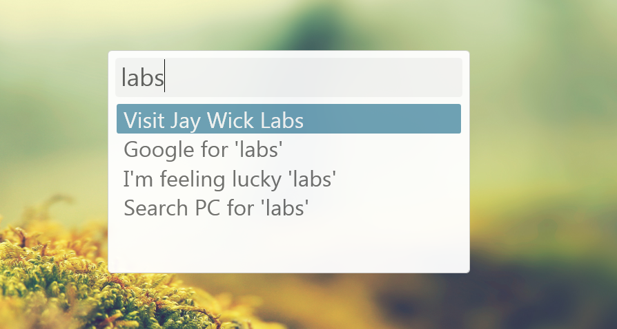

Vizr
====
[](https://ci.appveyor.com/project/jaywick/vizr)

A modern and humble quick launcher for Windows



## Pre-alpha notes
Currently Vizr is going major architectural changes.
This is a public alpha-preview so the schema and interfaces will be guaranteed to change.

**Do not rely on your user commands or plugins at this time!**

### Terminology

| Term | Description |
|------|-------------|
| Entry | An item that appears in the list of results |
| Action | An entry which is a file or program that can be launched |
| Requests | Like actions but with arguments ** - no longer supported** |

## Search results

### Actions
A custom list of actions (files or programs that can be launched) is searched with from the following path

    %APPDATA%\Jay Wick Labs\Vizr\actions.xml

The schema for this file is

```xml
<actions>
	<items>
		<action title="Visit Jay Wick Labs">http://labs.jay-wick.com</action>
		<action title="Windows Explorer" tags="folders,browse">c:\windows\explorer.exe</action>
		<action title="Run console as admin" runElevated="true">c:\windows\system32\cmd.exe</action>
	</items>
</actions>
```

### StartMenu

All links in both the common and user start menus are shown. Excludes anything with term `"uninstal"` in the name.
