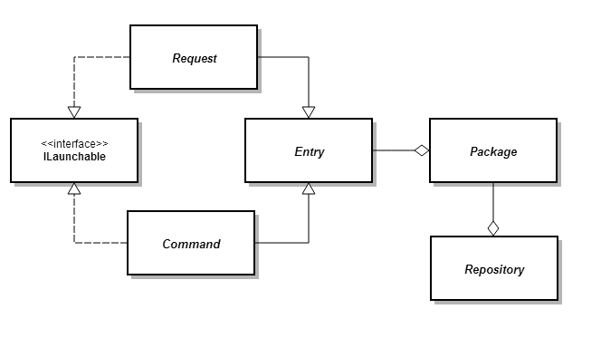

Vizr
====

A Modern and humble quick launcher for Windows


## Pre-alpha notes
* Commands are stored in

		%APPDATA%\Jay Wick Labs\Vizr\Packages

* The *schema is not finalised* and is **guaranteed to change** during pre-alpha and crash

## Schema
The current build supports the following template

```xml
<VizrPackage Version="0.1">
	<Items>
		<Action Title="Visit Jay Wick Labs">http://labs.jay-wick.com</Action>
		<Request Title="Search IMDB for '{0}'" Pattern="imdb (.+)">http://www.imdb.com/find?q={0}</Request>
		<Request Title="Google for '{0}'" Pattern="(.+)">https://www.google.com/search?q={0}</Request>
		<Request Title="I'm feeling lucky '{0}'" Pattern="(.+)">https://www.google.com/search?q={0}&amp;btnI</Request>
		<Request Title="Search PC for '{0}'" Pattern="(.+)">search-ms:query={0}&amp;</Request>
	</Items>
</VizrPackage>
```

## Terms
| Term | Description |
|------|-------------|
| **Package** | A list of entries |
| **Entry** | An item that appears in the list of results |
| **Action** | An instruction like 'run this file' |
| **Request** | An instruction involving an argument such as 'define <word>' |
| **Pattern** | Text to match an entry _(for requests it can include regular expressions)_ |
| **Launchable** | an entry that can launch something _(e.g. webpage, file)_ |
| **`{0}`** | the placeholder for the argument |

