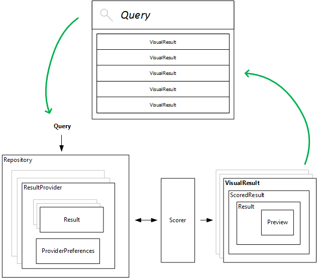

Vizr
====

A modern and humble quick launcher for Windows

## Architecture

In Vizr we start with a user's Query and end up with a bunch of Results. Here's the gist!

## Startup
Run in background using this command line

    vizr.exe /startup

When it's running in the background, click <kbd>Alt</kbd> + <kbd>Space</kbd>

## Breaking Changes
Currently Vizr is going major architectural changes.
This is a public alpha-preview so the schema and interfaces is guaranteed to change.

**Do not rely on your preference files or plugins at this time!**

## Standard Providers
* **Actions** - user defined actions
* **File System Search** - search for files and folders
* **Start Menu** - shortcuts from the start menu
* **Generate Password** _(experimental)_ - returns a random password
